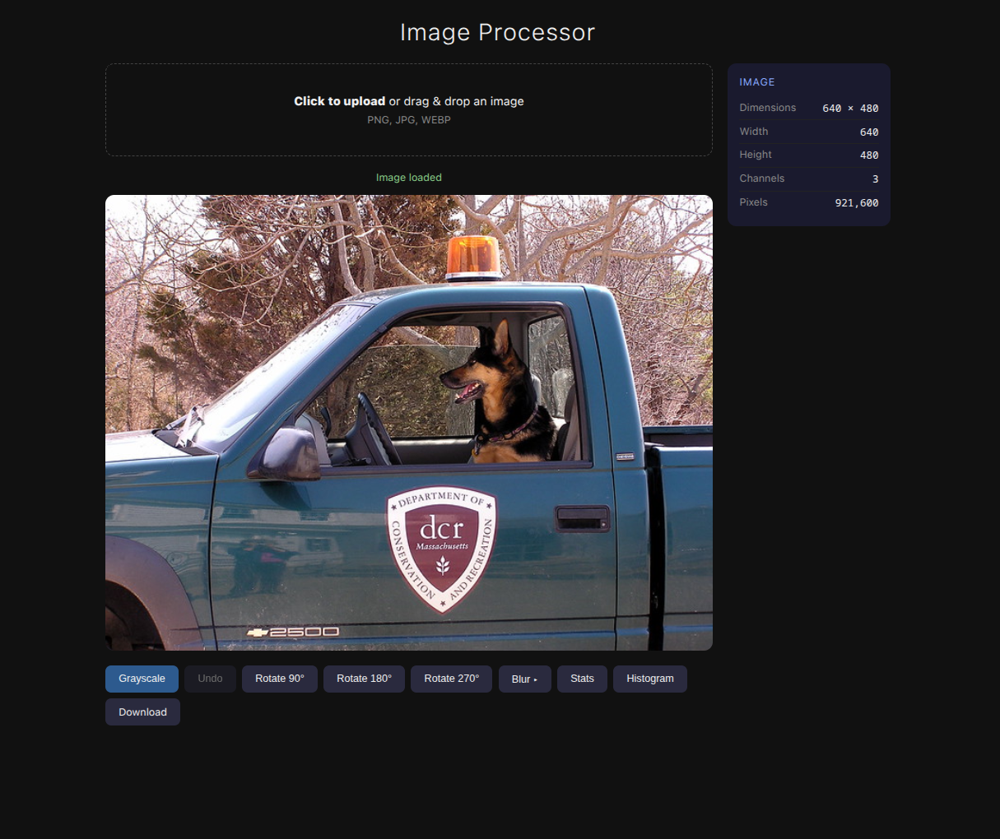

# Showcase (Web Version)



# How to run

For the cli version :

```bash
cargo run -p image_cli
```

For the web version :

```bash
cargo run -p image_web
```


# Things to add 


### 1. Spatial/Convolutional Features
*   **`apply_gaussian_blur(kernel_size: usize, sigma: f32)`**: Necessary for noise reduction and smoothing.
*   **`apply_sobel_operator()`**: Extracts edge magnitude and direction features (crucial for object detection).
*   **`apply_laplacian_filter()`**: Used for blob detection and image sharpening.
*   **`apply_box_filter(kernel_size: usize)`**: A faster alternative to Gaussian blur for general feature smoothing.

### 2. Statistical & Morphological Features
*   **`get_image_entropy()`**: Measures the complexity/information density of the image.
*   **`get_image_variance()`**: A core metric for contrast analysis (feature distinctiveness).
*   **`get_image_skewness_kurtosis()`**: Provides data on the distribution shape of pixel intensities.
*   **`apply_threshold(value: f32)`**: Generates binary feature masks (segmentation).
*   **`apply_dilation_erosion()`**: Morphological operations to clean up masks or extract shapes.

### 3. Normalization & Preprocessing (For ML Pipelines)
*   **`normalize_z_score()`**: Shifts the data to have a mean of 0 and std-dev of 1 (essential for Neural Network input).
*   **`rescale_image(new_width: u32, new_height: u32)`**: Standardizes image dimensions for model compatibility (interpolation).
*   **`clip_outliers(min: f32, max: f32)`**: Prevents extreme pixel values from affecting ML training convergence.
*   **`flatten()`**: Converts the `RawImage` data into a 1D vector (or feature array) ready for model input.

### 4. Image Quality/Metric Features
*   **`get_contrast_ratio()`**: Specifically, the Michelson or RMS contrast.
*   **`get_luminance_map()`**: Extracts the Y channel (from YCbCr conversion) as a feature, which is often more useful for models than raw RGB.
*   **`compute_mse(img1: &RawImage, img2: &RawImage)`**: Mean Squared Error, used to calculate reconstruction loss in Autoencoders or compression quality.

### 5. Advanced Geometry/Structure
*   **`get_bounding_box(threshold: f32)`**: Finds the minimal rectangle enclosing non-zero features.
*   **`calculate_centroid()`**: Returns the center of mass of the image intensities (useful for object localization).
*   **`apply_affine_transform(matrix: [[f32; 3]; 2])`**: For image augmentation (scaling, shearing, translation).

### 6. Safety & Debugging Additions
*   **`is_valid_coord(x: u32, y: u32)`**: A helper to resolve the `TODO` regarding out-of-bounds errors before attempting to access pixel data.
*   **`to_grayscale_luminance_weighted()`**: Instead of simple averaging, use the perceptually accurate formula: `0.299R + 0.587G + 0.114B`.


